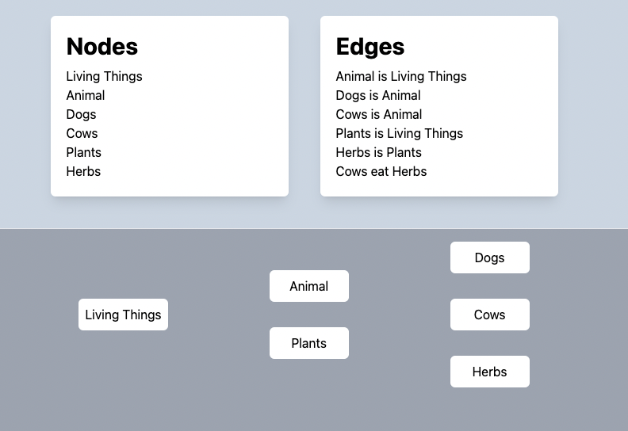

# Knowledge Base Frontend

## Start the dev server
```
yarn dev --host
```

## TODO
* visualize the graph
    * visualize edges
* draggable Node and Edge
* more model features
    * `node.findRelated({type: "is"})`
    * `kg.load`
    * `kg.dump`

## current snapshot
