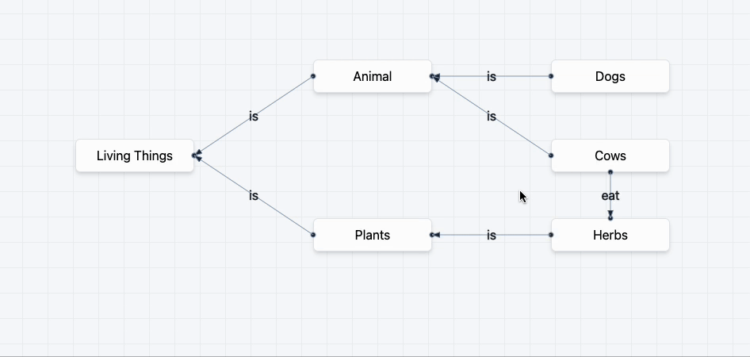

# Knowledge Base Frontend

## Start the dev server
```
yarn dev --host
```

## TODO
* [x] visualize the graph
    * [x] visualize edges
* [ ] draggable Node and Edge
* [x] more model features
    * [ ] `node.findRelated({type: "is"})`
    * [x] `kg.load` `kg.dump` yaml
* [ ] drag only works on chrome. Firefox has this bug since 2010. May decide switch to Flutter

## current snapshot
